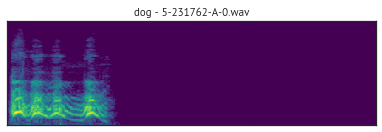

## ESC-50: Dataset for Environmental Sound Classification

> ###### [Overview](#esc-50-dataset-for-environmental-sound-classification) | [Download](#download) | [Results](#results) | [Repository content](#repository-content) | [License](#license) | [Citing](#citing) | [Caveats](#caveats) | [Changelog](#changelog)
>
> &nbsp;
<a href="LICENSE">&nbsp;
&nbsp;

The **ESC-50 dataset** is a labeled collection of 2000 environmental audio recordings suitable for benchmarking methods of environmental sound classification.

The dataset consists of 5-second-long recordings organized into 50 semantical classes (with 40 examples per class) loosely arranged into 5 major categories:

| Animals | Natural soundscapes & water sounds  | Human, non-speech sounds | Interior/domestic sounds | Exterior/urban noises |
| :--- | :--- | :--- | :--- | :--- |
| Dog | Rain | Crying baby | Door knock | Helicopter |
| Rooster | Sea waves | Sneezing | Mouse click | Chainsaw |
| Pig | Crackling fire | Clapping | Keyboard typing | Siren |
| Cow | Crickets | Breathing | Door, wood creaks | Car horn |
| Frog | Chirping birds | Coughing | Can opening | Engine |
| Cat | Water drops | Footsteps | Washing machine | Train |
| Hen | Wind | Laughing | Vacuum cleaner | Church bells |
| Insects (flying) | Pouring water | Brushing teeth | Clock alarm | Airplane |
| Sheep | Toilet flush | Snoring | Clock tick | Fireworks |
| Crow | Thunderstorm | Drinking, sipping | Glass breaking | Hand saw |

Clips in this dataset have been manually extracted from public field recordings gathered by the **[Freesound.org project](http://freesound.org/)**. The dataset has been prearranged into 5 folds for comparable cross-validation, making sure that fragments from the same original source file are contained in a single fold.

A more thorough description of the dataset is available in the original [paper](http://karol.piczak.com/papers/Piczak2015-ESC-Dataset.pdf) with some supplementary materials on GitHub: **[ESC: Dataset for Environmental Sound Classification - paper replication data](https://github.com/karoldvl/paper-2015-esc-dataset)**.

## Download

The dataset can be downloaded as a single .zip file (~600 MB):

**[Download ESC-50 dataset](https://github.com/karoldvl/ESC-50/archive/master.zip)**

## Results

Numerous machine learning & signal processing approaches have been evaluated on the ESC-50 dataset. Most of them are listed here. If you know of some other reference, you can message me or open a Pull Request directly.

> ###### Terms used in the table:
> 
> • CNN - Convolutional Neural Network • CRNN - Convolutional Recurrent Neural Network • GMM - Gaussian Mixture Model • GTCC - Gammatone Cepstral Coefficients • GTSC - Gammatone Spectral Coefficients • k-NN - k-Neareast Neighbors • MFCC - Mel-Frequency Cepstral Coefficients • MLP - Multi-Layer Perceptron • RBM - Restricted Boltzmann Machine • RNN - Recurrent Neural Network • SVM - Support Vector Machine • TEO - Teager Energy Operator • ZCR - Zero-Crossing Rate

| Title | Notes | Accuracy | Paper | Code |
| :--- | :--- | :--- | :--- | :--- |
| **AST: Audio Spectrogram Transformer** | Pure Attention Model Pretrained on AudioSet | 95.70% | [gong2021](https://arxiv.org/pdf/2104.01778.pdf) | <a href="https://github.com/YuanGongND/ast">:scroll:</a> |
| **A Sequential Self Teaching Approach for Improving Generalization in Sound Event Recognition** | Multi-stage sequential learning with knowledge transfer from Audioset | 94.10% | [kumar2020](https://arxiv.org/pdf/2007.00144.pdf) |  |
| **Efficient End-to-End Audio Embeddings Generation for Audio Classification on Target Applications** | CNN model pretrained on AudioSet | 92.32% | [lopez-meyer2021](https://ieeexplore.ieee.org/document/9414229) |  |
| **Urban Sound Tagging using Multi-Channel Audio Feature with Convolutional Neural Networks** | Pretrained model with multi-channel features | 89.50% | [kim2020](http://dcase.community/documents/challenge2020/technical_reports/DCASE2020_JHKim_21_t5.pdf) | <a href="https://github.com/JaehunKim-DeepLearning/Dcase2020_Task5">:scroll:</a> |
| **An Ensemble of Convolutional Neural Networks for Audio Classification** | CNN ensemble with data augmentation | 88.65% | [nanni2020](https://arxiv.org/pdf/2007.07966.pdf) | <a href="https://github.com/LorisNanni/Ensemble-of-Convolutional-Neural-Networks-for-Bioimage-Classification">:scroll:</a> |
| **Environmental Sound Classification on the Edge: A Pipeline for Deep Acoustic Networks on Extremely Resource-Constrained Devices** | CNN model (ACDNet) with potential compression | 87.1% | [mohaimenuzzaman2021](https://arxiv.org/pdf/2103.03483.pdf) | <a href="https://anonymous.4open.science/r/71077d05-6666-43a7-ae73-ec5ce2bef91b/">:scroll:</a> |
| **Unsupervised Filterbank Learning Using Convolutional Restricted Boltzmann Machine for Environmental Sound Classification** | CNN with filterbanks learned using convolutional RBM + fusion with GTSC and mel energies | 86.50% | [sailor2017](https://pdfs.semanticscholar.org/f6fd/1be38a2d764d900b11b382a379efe88b3ed6.pdf) |  |
| **AclNet: efficient end-to-end audio classification CNN** | CNN with mixup and data augmentation | 85.65% | [huang2018](https://arxiv.org/pdf/1811.06669.pdf) |  |
| **On Open-Set Classification with L3-Net Embeddings for Machine Listening Applications** | x-vector network with openll3 embeddings | 85.00% | [wilkinghoff2020](https://www.eurasip.org/Proceedings/Eusipco/Eusipco2020/pdfs/0000800.pdf) |  |
| **Learning from Between-class Examples for Deep Sound Recognition** | EnvNet-v2 ([tokozume2017a](http://www.mi.t.u-tokyo.ac.jp/assets/publication/LEARNING_ENVIRONMENTAL_SOUNDS_WITH_END-TO-END_CONVOLUTIONAL_NEURAL_NETWORK-poster.pdf)) + data augmentation + Between-Class learning | 84.90% | [tokozume2017b](https://openreview.net/forum?id=B1Gi6LeRZ) |  |
| **Novel Phase Encoded Mel Filterbank Energies for Environmental Sound Classification** | CNN working with phase encoded mel filterbank energies (PEFBEs), fusion with Mel energies | 84.15% | [tak2017](https://www.researchgate.net/profile/Dharmesh_Agrawal/publication/320733074_Novel_Phase_Encoded_Mel_Filterbank_Energies_for_Environmental_Sound_Classification/links/5a084c780f7e9b68229c8947/Novel-Phase-Encoded-Mel-Filterbank-Energies-for-Environmental-Sound-Classification.pdf) |  |
| **Knowledge Transfer from Weakly Labeled Audio using Convolutional Neural Network for Sound Events and Scenes** | CNN pretrained on AudioSet | 83.50% | [kumar2017](https://arxiv.org/pdf/1711.01369.pdf) | <a href="https://github.com/anuragkr90/weak_feature_extractor">:scroll:</a> |
| **Unsupervised Filterbank Learning Using Convolutional Restricted Boltzmann Machine for Environmental Sound Classification** | CNN with filterbanks learned using convolutional RBM + fusion with GTSC | 83.00% | [sailor2017](https://pdfs.semanticscholar.org/f6fd/1be38a2d764d900b11b382a379efe88b3ed6.pdf) |  |
| **Deep Multimodal Clustering for Unsupervised Audiovisual Learning** | CNN + unsupervised audio-visual learning | 82.60% | [hu2019](http://openaccess.thecvf.com/content_CVPR_2019/papers/Hu_Deep_Multimodal_Clustering_for_Unsupervised_Audiovisual_Learning_CVPR_2019_paper.pdf) |  |
| **Novel TEO-based Gammatone Features for Environmental Sound Classification** | Fusion of GTSC & TEO-GTSC with CNN | 81.95% | [agrawal2017](http://www.eurasip.org/Proceedings/Eusipco/Eusipco2017/papers/1570347591.pdf) |  |
| **Learning from Between-class Examples for Deep Sound Recognition** | EnvNet-v2 ([tokozume2017a](http://www.mi.t.u-tokyo.ac.jp/assets/publication/LEARNING_ENVIRONMENTAL_SOUNDS_WITH_END-TO-END_CONVOLUTIONAL_NEURAL_NETWORK-poster.pdf)) + Between-Class learning | 81.80% | [tokozume2017b](https://openreview.net/forum?id=B1Gi6LeRZ) |  |
| :headphones: ***Human accuracy*** | Crowdsourcing experiment in classifying ESC-50 by human listeners | 81.30% | [piczak2015a](http://karol.piczak.com/papers/Piczak2015-ESC-Dataset.pdf) | <a href="https://github.com/karoldvl/paper-2015-esc-dataset">:scroll:</a> |
| **Objects that Sound** | *Look, Listen and Learn* (L3) network ([arandjelovic2017a](https://arxiv.org/pdf/1705.08168.pdf)) with stride 2, larger batches and learning rate schedule | 79.80% | [arandjelovic2017b](https://arxiv.org/pdf/1712.06651.pdf) |  |
| **Look, Listen and Learn** | 8-layer convolutional subnetwork pretrained on an audio-visual correspondence task | 79.30% | [arandjelovic2017a](https://arxiv.org/pdf/1705.08168.pdf) |  |
| **Learning Environmental Sounds with Multi-scale Convolutional Neural Network** | Multi-scale convolutions with feature fusion (waveform + spectrogram) | 79.10% | [zhu2018](https://arxiv.org/pdf/1803.10219.pdf) |  |
| **Novel TEO-based Gammatone Features for Environmental Sound Classification** | GTSC with CNN | 79.10% | [agrawal2017](http://www.eurasip.org/Proceedings/Eusipco/Eusipco2017/papers/1570347591.pdf) |  |
| **Learning from Between-class Examples for Deep Sound Recognition** | EnvNet-v2 ([tokozume2017a](http://www.mi.t.u-tokyo.ac.jp/assets/publication/LEARNING_ENVIRONMENTAL_SOUNDS_WITH_END-TO-END_CONVOLUTIONAL_NEURAL_NETWORK-poster.pdf)) + data augmentation | 78.80% | [tokozume2017b](https://openreview.net/forum?id=B1Gi6LeRZ) |  |
| **Unsupervised Filterbank Learning Using Convolutional Restricted Boltzmann Machine for Environmental Sound Classification** | CNN with filterbanks learned using convolutional RBM | 78.45% | [sailor2017](https://pdfs.semanticscholar.org/f6fd/1be38a2d764d900b11b382a379efe88b3ed6.pdf) |  |
| **Learning from Between-class Examples for Deep Sound Recognition** | Baseline CNN ([piczak2015b](http://karol.piczak.com/papers/Piczak2015-ESC-ConvNet.pdf)) + Batch Normalization + Between-Class learning | 76.90% | [tokozume2017b](https://openreview.net/forum?id=B1Gi6LeRZ) |  |
| **Novel TEO-based Gammatone Features for Environmental Sound Classification** | TEO-GTSC with CNN | 74.85% | [agrawal2017](http://www.eurasip.org/Proceedings/Eusipco/Eusipco2017/papers/1570347591.pdf) |  |
| **Learning from Between-class Examples for Deep Sound Recognition** | EnvNet-v2 ([tokozume2017a](http://www.mi.t.u-tokyo.ac.jp/assets/publication/LEARNING_ENVIRONMENTAL_SOUNDS_WITH_END-TO-END_CONVOLUTIONAL_NEURAL_NETWORK-poster.pdf)) | 74.40% | [tokozume2017b](https://openreview.net/forum?id=B1Gi6LeRZ) |  |
| **Soundnet: Learning sound representations from unlabeled video** | 8-layer CNN (raw audio) with transfer learning from unlabeled videos | 74.20% | [aytar2016](http://papers.nips.cc/paper/6146-soundnet-learning-sound-representations-from-unlabeled-video.pdf) | <a href="https://github.com/cvondrick/soundnet">:scroll:</a> |
| **Learning from Between-class Examples for Deep Sound Recognition** | 18-layer CNN on raw waveforms ([dai2016](https://arxiv.org/pdf/1610.00087.pdf)) + Between-Class learning | 73.30% | [tokozume2017b](https://openreview.net/forum?id=B1Gi6LeRZ) |  |
| **Novel Phase Encoded Mel Filterbank Energies for Environmental Sound Classification** | CNN working with phase encoded mel filterbank energies (PEFBEs) | 73.25% | [tak2017](https://www.researchgate.net/profile/Dharmesh_Agrawal/publication/320733074_Novel_Phase_Encoded_Mel_Filterbank_Energies_for_Environmental_Sound_Classification/links/5a084c780f7e9b68229c8947/Novel-Phase-Encoded-Mel-Filterbank-Energies-for-Environmental-Sound-Classification.pdf) |  |
| **Classifying environmental sounds using image recognition networks** | 16 kHz sampling rate, GoogLeNet on spectrograms (40 ms frame length) | 73.20% | [boddapati2017](https://www.sciencedirect.com/science/article/pii/S1877050917316599) | <a href="https://github.com/bkasvenkatesh/Classifying-Environmental-Sounds-with-Image-Networks">:scroll:</a> |
| **Learning from Between-class Examples for Deep Sound Recognition** | Baseline CNN ([piczak2015b](http://karol.piczak.com/papers/Piczak2015-ESC-ConvNet.pdf)) + Batch Normalization | 72.40% | [tokozume2017b](https://openreview.net/forum?id=B1Gi6LeRZ) |  |
| **Novel TEO-based Gammatone Features for Environmental Sound Classification** | Fusion of MFCC & TEO-GTCC with GMM | 72.25% | [agrawal2017](http://www.eurasip.org/Proceedings/Eusipco/Eusipco2017/papers/1570347591.pdf) |  |
| **Learning environmental sounds with end-to-end convolutional neural network (EnvNet)** | Combination of spectrogram and raw waveform CNN | 71.00% | [tokozume2017a](http://www.mi.t.u-tokyo.ac.jp/assets/publication/LEARNING_ENVIRONMENTAL_SOUNDS_WITH_END-TO-END_CONVOLUTIONAL_NEURAL_NETWORK-poster.pdf) |  |
| **Novel TEO-based Gammatone Features for Environmental Sound Classification** | TEO-GTCC with GMM | 68.85% | [agrawal2017](http://www.eurasip.org/Proceedings/Eusipco/Eusipco2017/papers/1570347591.pdf) |  |
| **Classifying environmental sounds using image recognition networks** | 16 kHz sampling rate, AlexNet on spectrograms (30 ms frame length) | 68.70% | [boddapati2017](https://www.sciencedirect.com/science/article/pii/S1877050917316599) | <a href="https://github.com/bkasvenkatesh/Classifying-Environmental-Sounds-with-Image-Networks">:scroll:</a> |
| **Very Deep Convolutional Neural Networks for Raw Waveforms** | 18-layer CNN on raw waveforms | 68.50% | [dai2016](https://arxiv.org/pdf/1610.00087.pdf), [tokozume2017b](https://openreview.net/forum?id=B1Gi6LeRZ) | <a href="https://github.com/philipperemy/very-deep-convnets-raw-waveforms">:scroll:</a> |
| **Classifying environmental sounds using image recognition networks** | 32 kHz sampling rate, GoogLeNet on spectrograms (30 ms frame length) | 67.80% | [boddapati2017](https://www.sciencedirect.com/science/article/pii/S1877050917316599) | <a href="https://github.com/bkasvenkatesh/Classifying-Environmental-Sounds-with-Image-Networks">:scroll:</a> |
| **WSNet: Learning Compact and Efficient Networks with Weight Sampling** | SoundNet 8-layer CNN architecture with 100x model compression | 66.25% | [jin2017](https://openreview.net/forum?id=H1I3M7Z0b) |  |
| **Soundnet: Learning sound representations from unlabeled video** | 5-layer CNN (raw audio) with transfer learning from unlabeled videos | 66.10% | [aytar2016](http://papers.nips.cc/paper/6146-soundnet-learning-sound-representations-from-unlabeled-video.pdf) | <a href="https://github.com/cvondrick/soundnet">:scroll:</a> |
| **WSNet: Learning Compact and Efficient Networks with Weight Sampling** | SoundNet 8-layer CNN architecture with 180x model compression | 65.80% | [jin2017](https://openreview.net/forum?id=H1I3M7Z0b) |  |
| **Soundnet: Learning sound representations from unlabeled video** | 5-layer CNN trained on raw audio of ESC-50 only | 65.00% | [aytar2016](http://papers.nips.cc/paper/6146-soundnet-learning-sound-representations-from-unlabeled-video.pdf) | <a href="https://github.com/cvondrick/soundnet">:scroll:</a> |
| :bar_chart: **Environmental Sound Classification with Convolutional Neural Networks** - ***CNN baseline*** | CNN with 2 convolutional and 2 fully-connected layers, mel-spectrograms as input, vertical filters in the first layer | 64.50% | [piczak2015b](http://karol.piczak.com/papers/Piczak2015-ESC-ConvNet.pdf) | <a href="https://github.com/karoldvl/paper-2015-esc-convnet">:scroll:</a> |
| **auDeep: Unsupervised Learning of Representations from Audio with Deep Recurrent Neural Networks** | MLP classifier on features extracted with an RNN autoencoder | 64.30% | [freitag2017](https://arxiv.org/pdf/1712.04382.pdf) | <a href="https://github.com/auDeep/auDeep">:scroll:</a> |
| **Classifying environmental sounds using image recognition networks** | 32 kHz sampling rate, AlexNet on spectrograms (30 ms frame length) | 63.20% | [boddapati2017](https://www.sciencedirect.com/science/article/pii/S1877050917316599) | <a href="https://github.com/bkasvenkatesh/Classifying-Environmental-Sounds-with-Image-Networks">:scroll:</a> |
| **Classifying environmental sounds using image recognition networks** | CRNN | 60.30% | [boddapati2017](https://www.sciencedirect.com/science/article/pii/S1877050917316599) | <a href="https://github.com/bkasvenkatesh/Classifying-Environmental-Sounds-with-Image-Networks">:scroll:</a> |
| **Comparison of Time-Frequency Representations for Environmental Sound Classification using Convolutional Neural Networks** | 3-layer CNN with vertical filters on wideband mel-STFT (*median accuracy*) | *56.37%* | [huzaifah2017](https://arxiv.org/pdf/1706.07156.pdf) |  |
| **Comparison of Time-Frequency Representations for Environmental Sound Classification using Convolutional Neural Networks** | 3-layer CNN with square filters on wideband mel-STFT (*median accuracy*) | *54.00%* | [huzaifah2017](https://arxiv.org/pdf/1706.07156.pdf) |  |
| **Soundnet: Learning sound representations from unlabeled video** | 8-layer CNN trained on raw audio of ESC-50 only | 51.10% | [aytar2016](http://papers.nips.cc/paper/6146-soundnet-learning-sound-representations-from-unlabeled-video.pdf) | <a href="https://github.com/cvondrick/soundnet">:scroll:</a> |
| **Comparison of Time-Frequency Representations for Environmental Sound Classification using Convolutional Neural Networks** | 5-layer CNN with square filters on wideband mel-STFT (*median accuracy*) | *50.87%* | [huzaifah2017](https://arxiv.org/pdf/1706.07156.pdf) |  |
| **Comparison of Time-Frequency Representations for Environmental Sound Classification using Convolutional Neural Networks** | 5-layer CNN with vertical filters on wideband mel-STFT (*median accuracy*) | *46.25%* | [huzaifah2017](https://arxiv.org/pdf/1706.07156.pdf) |  |
| :bar_chart: ***Baseline - random forest*** | Baseline ML approach (MFCC & ZCR + random forest) | 44.30% | [piczak2015a](http://karol.piczak.com/papers/Piczak2015-ESC-Dataset.pdf) | <a href="https://github.com/karoldvl/paper-2015-esc-dataset">:scroll:</a> |
| **Soundnet: Learning sound representations from unlabeled video** | Convolutional autoencoder trained on unlabeled videos | 39.90% | [aytar2016](http://papers.nips.cc/paper/6146-soundnet-learning-sound-representations-from-unlabeled-video.pdf) | <a href="https://github.com/cvondrick/soundnet">:scroll:</a> |
| :bar_chart: ***Baseline - SVM*** | Baseline ML approach (MFCC & ZCR + SVM) | 39.60% | [piczak2015a](http://karol.piczak.com/papers/Piczak2015-ESC-Dataset.pdf) | <a href="https://github.com/karoldvl/paper-2015-esc-dataset">:scroll:</a> |
| :bar_chart: ***Baseline - k-NN*** | Baseline ML approach (MFCC & ZCR + k-NN) | 32.20% | [piczak2015a](http://karol.piczak.com/papers/Piczak2015-ESC-Dataset.pdf) | <a href="https://github.com/karoldvl/paper-2015-esc-dataset">:scroll:</a> |
| **A mixture model-based real-time audio sources classification method** | Dictionary of sound models used for classification (*accuracy is computed on segments instead of files*) | *94.00%* | [baelde2017](https://hal.archives-ouvertes.fr/hal-01420677v2/document) |  |
| **NELS - Never-Ending Learner of Sounds** | Large-scale audio crawling with classifiers trained on AED datasets (including ESC-50) | N/A | [elizalde2017](http://media.aau.dk/smc/wp-content/uploads/2017/12/ML4AudioNIPS17_paper_3.pdf) | <a href="http://nels.cs.cmu.edu/">:scroll:</a> |
| **Utilizing Domain Knowledge in End-to-End Audio Processing** | End-to-end CNN with learned mel-spectrogram transformation | N/A | [tax2017](https://arxiv.org/pdf/1712.00254.pdf) | <a href="https://github.com/corticph/MSTmodel">:scroll:</a> |
| **Deep Neural Network based learning and transferring mid-level audio features for acoustic scene classification** | Transfer learning from various datasets, including ESC-50 | N/A | [mun2017](https://pdfs.semanticscholar.org/5f1e/513aec29b8c471723172f1d5bc2174daa71a.pdf) |  |
| **Features and Kernels for Audio Event Recognition** | MFCC, GMM, SVM | N/A | [kumar2016b](https://arxiv.org/pdf/1607.05765.pdf) |  |
| **A real-time environmental sound recognition system for the Android OS** | Real-time sound recognition for Android evaluated on ESC-10 | N/A | [pillos2016](https://www.cs.tut.fi/sgn/arg/dcase2016/documents/workshop/Pillos-DCASE2016workshop.pdf) |  |
| **Comparing Time and Frequency Domain for Audio Event Recognition Using Deep Learning** | Discriminatory effectiveness of different signal representations compared on ESC-10 and Freiburg-106 | N/A | [hertel2016](https://arxiv.org/pdf/1603.05824.pdf) |  |
| **Audio Event and Scene Recognition: A Unified Approach using Strongly and Weakly Labeled Data** | Combination of weakly labeled data (YouTube) with strong labeling (ESC-10) for Acoustic Event Detection | N/A | [kumar2016a](https://arxiv.org/pdf/1611.04871.pdf) |  |

## Repository content

- [`audio/*.wav`](audio/)

  2000 audio recordings in WAV format (5 seconds, 44.1 kHz, mono) with the following naming convention:
  
  `{FOLD}-{CLIP_ID}-{TAKE}-{TARGET}.wav`
  
  - `{FOLD}` - index of the cross-validation fold,
  - `{CLIP_ID}` - ID of the original Freesound clip,
  - `{TAKE}` - letter disambiguating between different fragments from the same Freesound clip,
  - `{TARGET}` - class in numeric format [0, 49].

- [`meta/esc50.csv`](meta/esc50.csv)

  CSV file with the following structure:
  
  | filename | fold | target | category | esc10 | src_file | take |
  | :--- | :--- | :--- | :--- | :--- | :--- | :--- |
  
  The `esc10` column indicates if a given file belongs to the *ESC-10* subset (10 selected classes, CC BY license).
  
- [`meta/esc50-human.xlsx`](meta/esc50-human.xlsx)

  Additional data pertaining to the crowdsourcing experiment (human classification accuracy).

## License

The dataset is available under the terms of the [Creative Commons Attribution Non-Commercial license](http://creativecommons.org/licenses/by-nc/3.0/).

A smaller subset (clips tagged as *ESC-10*) is distributed under CC BY (Attribution).

Attributions for each clip are available in the [ LICENSE file](LICENSE).

## Citing

If you find this dataset useful in an academic setting please cite:

> K. J. Piczak. **ESC: Dataset for Environmental Sound Classification**. *Proceedings of the 23rd Annual ACM Conference on Multimedia*, Brisbane, Australia, 2015.
> 
> [DOI: http://dx.doi.org/10.1145/2733373.2806390]

    @inproceedings{piczak2015dataset,
      title = {{ESC}: {Dataset} for {Environmental Sound Classification}},
      author = {Piczak, Karol J.},
      booktitle = {Proceedings of the 23rd {Annual ACM Conference} on {Multimedia}},
      date = {2015-10-13},
      url = {http://dl.acm.org/citation.cfm?doid=2733373.2806390},
      doi = {10.1145/2733373.2806390},
      location = {{Brisbane, Australia}},
      isbn = {978-1-4503-3459-4},
      publisher = {{ACM Press}},
      pages = {1015--1018}
    }

## Caveats

Please be aware of potential information leakage while training models on *ESC-50*, as some of the original Freesound recordings were already preprocessed in a manner that might be class dependent (mostly bandlimiting). Unfortunately, this issue went unnoticed when creating the original version of the dataset. Due to the number of methods already evaluated on *ESC-50*, no changes rectifying this issue will be made in order to preserve comparability.

## Changelog

###### v2.0.0 (2017-12-13)

> • Change to WAV version as default.

###### v2.0.0-pre (2016-10-10) (wav-files branch)

> • Replace OGG recordings with cropped WAV files for easier loading and frame-level precision (some of the OGG recordings had a slightly different length when loaded). • Move recordings to a one directory structure with a meta CSV file.

###### v1.0.0 (2015-04-15)

> • Initial version of the dataset (OGG format).
